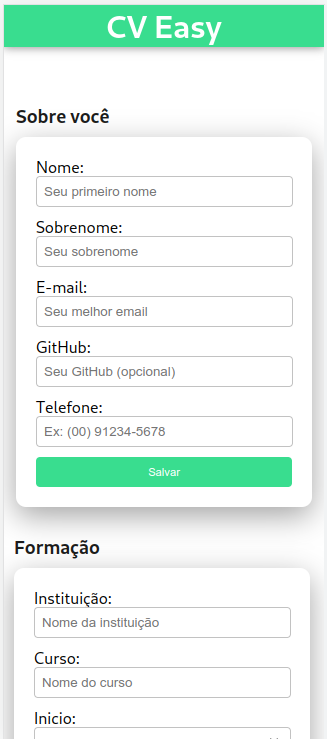
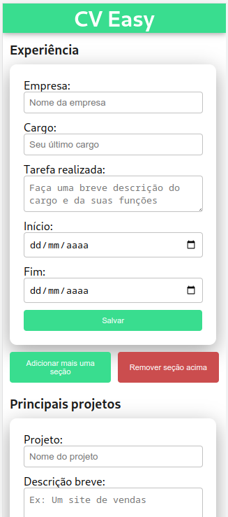
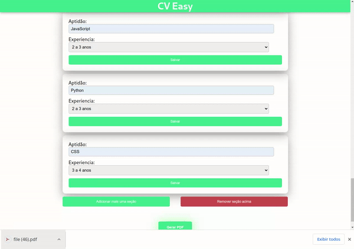

# CV Easy

Com foco em praticidade, esse sistema consiste numa solução para quem precisa criar curriculos para mais de um tipo de vaga, e não tem muita experiência com softwares de edição de texto como o Word por exemplo. Com o CV Easy o usuário precisa apenas preencher alguns campos e apertar um botão, com isso o sistema gera um arquivo PDF ja formatado e pronto para ser compartilhado. 

O modelo do cúrriculo foi inspirado no modelo recomendado pela [Microsoft](https://onedrive.live.com/view.aspx?resid=5967260DC122025C!3066&ithint=file%2cdocx&authkey=!AI4uxGBt3nYbU64) 

Link do projeto: https://easy-cv-xi.vercel.app/
## Screenshots





## Demonstração




## Stack utilizada

**Front-end:** React, Redux, CSS , PdfMake


## Rodando localmente

Clone o projeto

```bash
  git clone git@github.com:allanfernds/cv-maker.git
```

Entre no diretório do projeto

```bash
  cd cv-maker
```

Instale as dependências

```bash
  npm install
```

Inicie o servidor

```bash
  npm run start
```


## 🔗 Links
[](https://allanfernds.github.io/meu-portifolio/)
[](https://www.linkedin.com/in/alanfernds/)
[](https://www.instagram.com/_alanfernds/)

